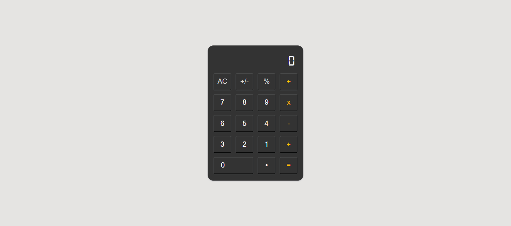

# 🧮 **Beautiful Calculator App**

A **simple, stylish, and functional calculator** built using **HTML, CSS, and JavaScript**. This calculator allows users to perform basic arithmetic operations with a smooth and intuitive user interface.



---

## 🎯 **Features**

- **Basic Arithmetic Operations**: Supports addition, subtraction, multiplication, and division.
- **Live Expression Display**: Shows the user's input and the result on a clean screen.
- **Elegant UI/UX**: Custom design with smooth button interactions and digital font styling.
- **Responsive Layout**: Works seamlessly across various screen sizes.
- **Clear and Reset Functionality**: Reset the calculation at any time.
- **Toggle Sign and Percentage Support**: Includes functionality for positive/negative toggles and percentage conversion.
- **Overflow Handling**: Dynamically adjusts font size to fit large numbers and ensures results do not overflow.

---

## 🛠️ **Tech Stack**

- **HTML5**: Structure of the app.
- **CSS3**: Styling the user interface with a modern and clean design.
- **JavaScript (ES6+)**: Logic to handle user interactions and perform calculations.

---

## 🚀 **How to Run the Project Locally**

1. **Clone the Repository**:
   ```bash
   git clone https://github.com/Mikiyas6/CODSOFT.git
   ```
2. **Navigate into the Project Folder**:
   ```bash
   cd calculator-app
   ```
3. **Open the Project in Your Browser**:
   - You can open the `index.html` file directly by double-clicking it or:
   ```bash
   open index.html
   ```
   - Alternatively, if you have `Live Server` installed:
     ```bash
     live-server
     ```

---

## 📂 **Project Structure**

```
/CODSOFT-Calculator
│
├── src/
│   ├── index.html        # Main HTML file
│   ├── index.css         # Stylesheet for the calculator UI
│   ├── index.js          # JavaScript logic for the calculator
│   └── assets/
│       └── fonts/        # Folder containing Digital-7 Mono font
│           └── digital-7.ttf
|       └── Images/
|           └── Calculator.png
│
└── README.md             # Project documentation (this file)
```

---

## 🎨 **Styling Inspiration**

- **Font**: `Digital-7 Mono` font to give the display a cool digital look.
- **Color Palette**:
  - **Primary**: Dark gray for the calculator body.
  - **Secondary**: Golden yellow for operation buttons.
  - **Light Gray**: Subtle background for better focus.
  - **White**: Display text and number buttons for clarity.

---

## ✨ **How It Works**

- **User Input**: Click numbers and operators to build an expression.
- **Live Expression Display**: Input is shown on the screen as you type.
- **Equal Button (`=`)**: Computes the final result.
- **Clear (`AC`)**: Resets the current expression.
- **Toggle Sign (`+/-`)**: Changes the current number’s sign.
- **Percentage (`%`)**: Converts the number into its percentage equivalent.

---

## 🐛 **Known Issues & Future Improvements**

- **Overflow Handling**: Font size dynamically adjusts to prevent overflow, but there might be edge cases for extremely long results.
- **Expression Error Handling**: Displays `"Error"` if the expression is invalid (e.g., dividing by zero).
- **Future Enhancements**:
  - Add support for **scientific operations** (e.g., square roots, exponents).
  - Improve **keyboard support** for a smoother experience.
  - Implement **dark mode** for better usability in low light.

---

## 🙌 **Contributing**

Contributions are welcome! If you have any suggestions or improvements, please follow these steps:

1. Fork the project.
2. Create a new branch:
   ```bash
   git checkout -b feature/your-feature
   ```
3. Commit your changes:
   ```bash
   git commit -m 'Add your feature'
   ```
4. Push to the branch:
   ```bash
   git push origin feature/your-feature
   ```
5. Open a Pull Request.

---

## 💬 **Contact**

- **Mikiyas Teowodroes**
- GitHub: [Mikiyas6](https://github.com/Mikiyas6)
- Email: Mikiyas.Tewodroes@A2SV.org

---

## ⭐ **Acknowledgments**

- **Digital-7 Mono Font**: A beautiful font that gives the calculator a retro digital feel.
- **CodSoft Web Development Internship**: Special thanks for the inspiration to build this project.

---

Feel free to copy and use this README template! You can also tweak the sections to suit your project perfectly.
